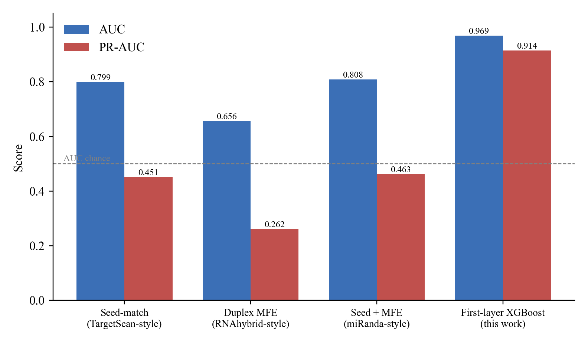
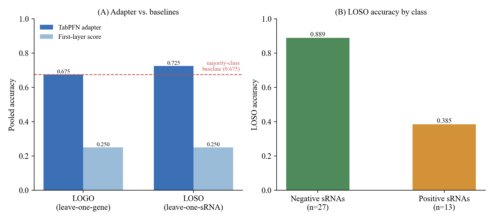

# MetaLulu-AI

**A Two-Stage Interpretable Framework for Predicting Plant-Derived Small RNA Targets on Human 3′UTRs**

*Computational framework: MetaLulu-AI*

Authors: Le Qiao, Weizhong Li

---

## Overview

MetaLulu-AI is a two-stage machine learning framework for predicting whether plant-derived small RNAs can target human mRNA 3′UTRs and produce experimentally detectable regulatory effects.

- **Stage 1** — An XGBoost model trained on 55,361 human miRNA–mRNA interaction records (from miRTarBase v10.0 and TarBase v8) using 41 interpretable bioinformatics features (seed-region pairing, local AU/GC context, RNA secondary structure thermodynamics, etc.). It outputs a foundational binding probability score.
- **Stage 2** — A TabPFN adapter trained on 40 wet-lab experimental samples (plant-derived sRNA transfections into human cell lines, readout by Western blot / ELISA at 48 h post-transfection). It refines Stage 1 scores using 52 features to predict experimental regulatory labels.

---

## Key Results

**Stage 1 vs. classical target-prediction tools** (held-out test set): the first-layer XGBoost model reaches **AUC 0.969 / PR-AUC 0.914**, substantially above seed-match, duplex-MFE, and seed+MFE proxies of TargetScan, RNAhybrid, and miRanda.



**Entity-held-out evaluation of Stage 2** (leave-one-gene-out / leave-one-small-RNA-out): the TabPFN adapter clearly beats the raw Stage 1 score baseline, but only matches or marginally exceeds the majority-class baseline (0.675) and remains weak on positive (regulatory) cases. Stage 2 should therefore be read strictly as a **proof of concept** pending a larger experimental dataset.



---

## Repository Contents

```
├── README.md
├── requirements.txt
│
├── stage2_experimental_data.csv      ← 40 wet-lab samples (Stage 2 training data)
├── stage1_full_metrics.csv           ← Stage 1 performance across train/val/test splits
├── stage2_logo_results.csv           ← Stage 2 leave-one-gene-out evaluation
├── stage2_loso_results.csv           ← Stage 2 leave-one-sRNA-out evaluation
├── baseline_comparison_metrics.csv   ← Comparison with TargetScan / RNAhybrid / miRanda proxies
├── reviewer_supplement_summary.json  ← Full numeric summary for all reported metrics
│
├── figures/
│   ├── fig_baseline.png              ← Stage 1 vs. classical-tool proxies
│   └── fig_entity.png                ← LOGO / LOSO entity-held-out evaluation
│
└── scripts/
    ├── build_bio_features.py                    ← Feature engineering (41/52-dim)
    ├── train_xgboost_bio.py                     ← Stage 1 XGBoost training
    ├── train_tabpfn_demo_realthermo_pruned.py   ← Stage 2 TabPFN training
    ├── score_sequence_pair_two_stage.py         ← Inference: score a sRNA–3′UTR pair
    ├── make_group_splits.py                     ← Gene/miRNA-based group splitting
    ├── audit_label_leakage.py                   ← Label leakage audit
    ├── audit_feature_redundancy.py              ← Feature redundancy audit
    ├── cv_tabpfn_demo_eval.py                   ← 5-fold cross-validation (Stage 2)
    ├── repeat_tabpfn_demo_eval.py               ← Repeated 70/30 splits (Stage 2)
    └── plot_stage2_shap_by_category.py          ← SHAP plots by feature category
```

---

## Stage 2 Experimental Dataset (`stage2_experimental_data.csv`)

This file contains the 40 wet-lab samples used to train and evaluate the Stage 2 TabPFN adapter. Each row represents one plant-derived sRNA × human target gene combination tested experimentally.

| Column | Description |
|--------|-------------|
| `srna_sequence` | Plant-derived small RNA sequence (RNA alphabet) |
| `target_gene` | Human target gene name |
| `cell_line` | Cell line used for transfection |
| `detection_method` | Protein readout method |
| `transfection_reagent` | Transfection reagent |
| `detection_timepoint_h` | Hours post-transfection at detection |
| `experimental_label` | **1** = significant endogenous protein level change detected; **0** = no significant change |

**Dataset statistics:**
- Total samples: 40 (13 positive, 27 negative)
- Target genes: EGLN1 (n=10, Hep3B), PDE5A (n=11, corpus cavernosum cells), SOST (n=9, UMR-106), CD38 (n=10, H9c2)
- Experimental protocol: 4 h transfection via Lipo3000, then 48 h incubation; Western blot or ELISA for protein quantification

---

## Stage 1 Data Sources

The Stage 1 XGBoost model was trained on publicly available human miRNA–mRNA interaction data:

- **Positive samples**: miRTarBase Release 10.0 (https://mirtarbase.cuhk.edu.cn/), filtered for *Homo sapiens* with strong experimental evidence (Western blot, reporter assay, qRT-PCR). 8,667 records after deduplication.
- **Negative samples**: TarBase v8 (http://diana.imis.athena-innovation.gr/DianaTools/), filtered for *Homo sapiens* with negative annotation. 46,694 records after deduplication.
- **Total**: 55,361 samples split gene-wise into train (38,752) / validation (5,536) / test (11,073).

> **Note**: The full 55,361-sample feature matrix is not included in this repository due to file size constraints. The feature engineering code (`scripts/build_bio_features.py`) can be used to regenerate features from the raw miRTarBase/TarBase downloads.

---

## Requirements

```
xgboost>=3.2.0
tabpfn==0.1.11
scikit-learn>=1.3
pandas>=2.0
numpy>=1.24
shap>=0.44
optuna>=3.0
ViennaRNA  (RNAfold v2.5.1, install separately: https://www.tbi.univie.ac.at/RNA/)
RNAhybrid  (v2.1.2, install separately: https://bibiserv.cebitec.uni-bielefeld.de/rnahybrid)
```

Install Python dependencies:
```bash
pip install -r requirements.txt
```

---

## Quickstart: Score a New sRNA–3′UTR Pair

```bash
python scripts/score_sequence_pair_two_stage.py \
    --srna GGGGAUGUAGCUCAGAUGGUA \
    --utr3 <target_3UTR_sequence>
```

---

## Reproducing Stage 2 Results

```bash
# 5-fold cross-validation on the 40 experimental samples
python scripts/cv_tabpfn_demo_eval.py

# Repeated 70/30 random splits (10 repeats)
python scripts/repeat_tabpfn_demo_eval.py
```

---

## Citation

If you use this code or data, please cite:

> Le Qiao, Weizhong Li. A Two-Stage Interpretable Framework for Predicting Plant-Derived Small RNA Targets on Human 3′UTRs (MetaLulu-AI framework). 2026. https://github.com/whiteqiao6253/metalulu-ai

---

## License

The code in this repository is released under the MIT License. The experimental dataset (`stage2_experimental_data.csv`) is released under CC BY 4.0.
